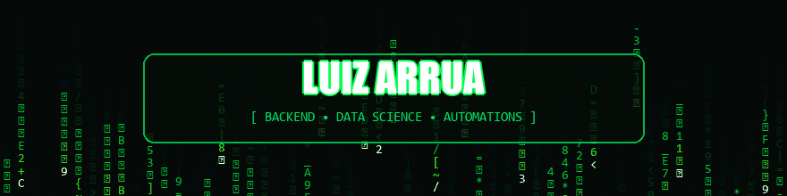

  

 

### ⚡ SOBRE MIM

Desenvolvedor de software com foco estratégico na convergência entre **desenvolvimento backend, integrações de sistemas, automação de processos e ciência de dados**. Foco total em resolver problemas práticos: eliminar trabalho manual repetitivo, conectar ecossistemas de APIs e transformar dados em soluções reais e escaláveis.

* 🎓 **Formação Acadêmica:**
  * **Análise e Desenvolvimento de Sistemas** — **PUCPR**
  * **Estatística e Ciência de Dados** — **UFPR**
* 💼 **Atuação & Prática:** Engenharia de software backend, arquitetura de APIs RESTful, webhooks e pipelines de dados.
* ⚙️ **Automação & Orquestração:** Fluxos corporativos com **n8n, Make, Zapier, Power Automate e Google Apps Script**.
* 🧠 **Domínios de Estudo:** Inteligência Artificial aplicada, microsserviços, modelagem estatística preditiva e otimização de sistemas.

 

### 🛠️ STACK TECNOLÓGICA

#### 💻 BACKEND & LINGUAGENS

 

#### ⚡ APIS & INTEGRAÇÕES

 

#### ⚙️ AUTOMAÇÃO & NO-CODE / LOW-CODE

 

#### 📊 DADOS, ESTATÍSTICA & ANALYTICS

 

#### 🌐 WEB & BANCO DE DADOS

 

### 📈 DASHBOARDS & MÉTRICAS DE ENGENHARIA

  <table border="0" style="border: none;">
    <tr style="background: transparent; border: none;">
      <td style="border: none; padding: 6px;" width="50%">
        
      </td>
      <td style="border: none; padding: 6px;" width="50%">
        
      </td>
    </tr>
    <tr style="background: transparent; border: none;">
      <td style="border: none; padding: 6px;" width="50%">
        
      </td>
      <td style="border: none; padding: 6px;" width="50%">
        
      </td>
    </tr>
  </table>

 

  

 

### 🚀 PROJETOS EM DESTAQUE

| Projeto | Descrição | Stack | Acesso |
| :--- | :--- | :--- | :---: |
| 📊 **PUCPR Machine Learning** | Exploração de dados, seleção de atributos e treinamento de modelos de aprendizado de máquina. | `Python` `Scikit-Learn` `Pandas` | [Acessar Repositório ↗](https://github.com/arrualuiz/PUCPRMachineLearning) |
| ⚡ **Desafio QuiteJá** | Aplicação frontend dinâmica e interativa desenvolvida com foco em usabilidade e performance. | `Vue.js` `JavaScript` `CSS3` | [Acessar Repositório ↗](https://github.com/arrualuiz/desafio-quiteja) |
| 🌐 **Portal & Dashboard Pessoal** | Interface web moderna reunindo utilitários, widgets, indicadores e atalhos de produtividade. | `TypeScript` `React` `HTML/CSS` | [Acessar Repositório ↗](https://github.com/arrualuiz/arrua-site-novo) |
| 🤖 **Hub de Automações & APIs** | Integrações automatizadas conectando APIs REST, Webhooks, WhatsApp Business e planilhas inteligentes. | `n8n` `Apps Script` `APIs` | [Acessar Repositório ↗](https://github.com/arrualuiz) |

 

### 📡 CONECTE-SE COMIGO

  <table border="0" style="border: none;">
    <tr style="background: transparent; border: none;">
      <td align="center" style="border: none; padding: 10px;">
        
      </td>
      <td align="center" style="border: none; padding: 10px;">
        
      </td>
      <td align="center" style="border: none; padding: 10px;">
        
      </td>
    </tr>
  </table>

